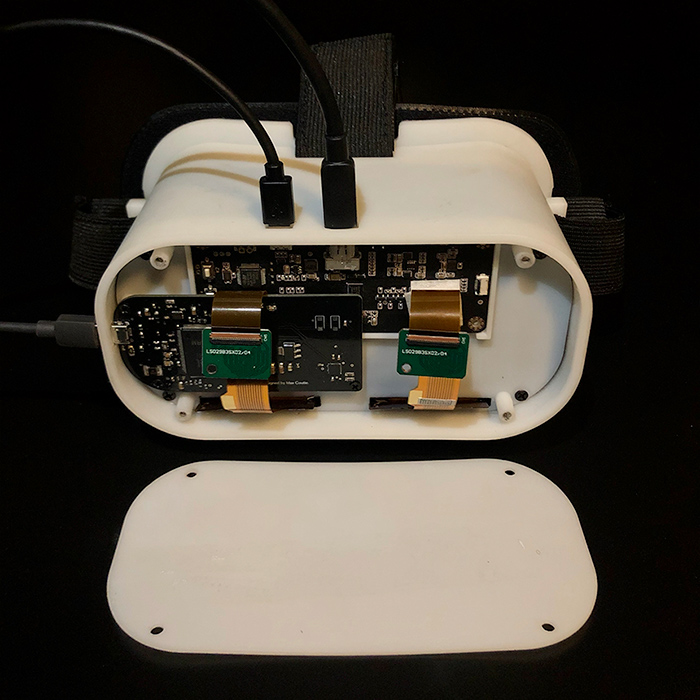
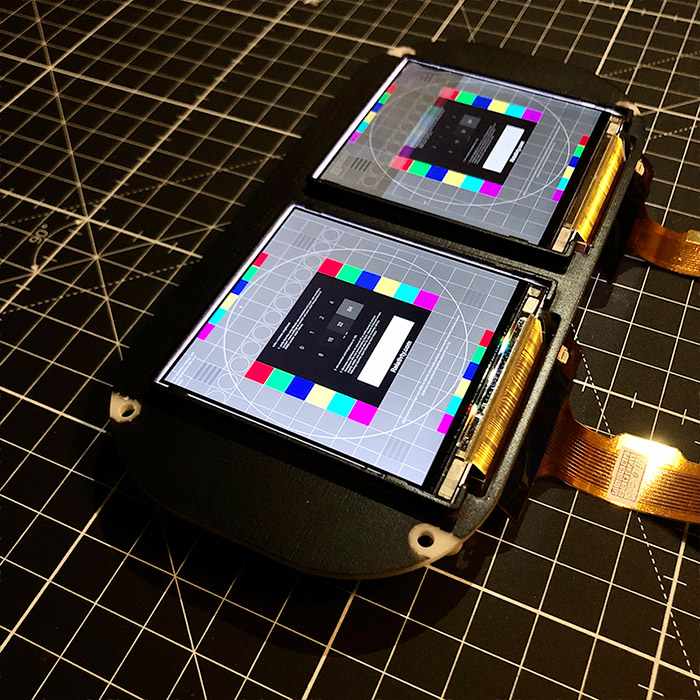
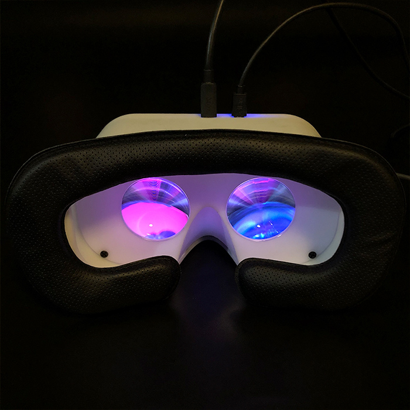

<h1 align="center">
  <br>
  <a href="https://github.com/relativty/Relativ"></a>
</h1>

<h4 align="center">We couldn't afford an Oculus so we built one
</h4>

<p align="center">
  
  
  
</p>


<h4 align="center">Build your own VR headset for $100 💸
</h4>

# Why Relativ? 📖

<p> My name is <a href="https://twitter.com/maximecoutte">Maxime Coutté</a>.  I’m 16 years old and I live in a small village in France where I’m the only teenager. With my best friends, <a href="https://medium.com/@jonasceccon">Jonas Ceccon</a> and <a href="https://medium.com/@gabrielcombe">Gabriel Combe</a>, and my math teacher <a href="https://www.linkedin.com/in/jérôme-dieudonne-696a18b5"> Jerome Dieudonne </a> (we call him Sensei) we built our own VR headset for $100.

<p> I started programming when I was 13, thanks to Sensei when he created a robotics club. On the first day we were 12 students, the next week we were 3 - yep, you guessed it, the other two were Gabriel and Jonas. I fell in love with VR because of an anime called SAO, but the problem was that the Oculus Rift was way too expensive for me. I talked about this with Gabriel and we both agreed that we should build our own VR headset. That got us into the math and physics behind VR (quaternions, proper acceleration, antiderivatives…). Then we bought the cheapest components we could and we reinvented VR. Now using <a href="https://github.com/relativty/fastVR-sdk">FastVR</a> and Relativ you can
build your VR headset too. </p>

# Meet the team ❤️

<p align="center">  </p>
<p align="center"> <strong> Gabriel: </strong>I work on optics for <a href="https://github.com/relativty/fastVR-sdk">FastVR</a>, 3D conception with Maxime and cheap tracking for the next big update. </p>

<p align="center">  </p>
<p align="center"> <strong> Maxime: </strong> I created <a href="https://github.com/relativty/wrmhl">WRMHL</a> and with Gabriel we created <a href="https://github.com/relativty/fastVR-sdk">FastVR</a>. I'm also behind the code for the hardware. </p>
<p align="center">  </p>
<p align="center"> <strong> Jonas: </strong>  I convinced a Chinese factory to sell us premium components at low prices and I'm working on a Master Guide for Relativ. </p>
<p align="center">  </p>
<p align="center"> <strong> Sensei: </strong>  I'm the theoretician of the team. I teach them math and I help them to solve algorithm issues. </p>

# Open-Source it FTW

<p> Thanks to this project I’ve had the incredible fortune to meet amazing people, including the chief architect at Oculus, Atman Binstock. He gave me a precious piece of advice: "open source it". I deleted all the code I had, and started rewriting it all from scratch, better. And I convinced my two friends and our math teacher to open source the project </p>


# Getting Started ⚡️

Relativ is based on <a href="https://github.com/relativty/wrmhl">WRMHL</a> and <a href="https://github.com/relativty/fastVR-sdk">FastVR</a>.

## What you'll need

### What components ?
First you will need the following components:
* Arduino Due, $34 for the official one or $10 for a Chinese clone
* GY-521 MPU-6050, $1
* 5.5 inch 2560*1440 2K LCD Screen HDMI to MIPI, up to 100€ on AliExpress (<a href="https://www.aliexpress.com/item/5-5-inch-1440x2560-2K-IPS-LCD-screen-display-with-HDMI-top-MIPI-controller-board-for/32817672501.html">recommended</a>) ⚠️ Price may vary a lot
* Fresnel lens Focal Length 80mm, $3 (<a href="https://www.ebay.com/itm/2Pcs-Fresnel-lens-Focal-Length-40-50-55-60-70-80mm-for-Google-Cardboard-3D-VR/201984369021">recommended</a>)


### How to Install?

You can either install it using [Git](https://git-scm.com/) or direct [Download](https://github.com/relativty/Relativ/archive/master.zip). Or from the <strong>command line</strong>:

```bash
# Clone this repository
$ git clone https://github.com/relativty/Relativ
```
Copy all folders in **Relativ/src/libraries** and past them in your Arduino Libraries folder: **Documents\Arduino\libraries**. You're now ready to build the headset!

# Building the hardware

Now what you need to do is 3D-print the hardware; if needed you can change any models with provided Source Files. You will need to print the following:
* Relativ_headset_structure.STL x1
* box_Arduino_DUE.stl x1
* box_lens_1.STL x2 ⚠️
* box_lens_2.STL x2 ⚠️
* box_mpu6050.STL x1
* box_screen_adaptor.STL x1
* box_screen_controller.STL x1
* box_screen_spherical.STL x1 OR box_screen.STL x1 ⚠️
* support_lens.STL x1

⚠️ **PAY EXTRA ATTENTION TO THE SCREEN, IT'S VERY FRAGILE** ⚠️


# Building the software

Make sure you have all the libraries needed installed and upload the following program to the Arduino:
#### Path: Relativ/src/main/main.ino


# Play some demos

<p> You can now play with your headset by downloading some cool demos by <a href="https://github.com/relativty/Relativ/releases/download/v0.1-beta/Unity_build.zip">clicking here<a/>. Or build your own game in a minute using the Relativty sdk, learn more by <a href="https://github.com/relativty/fastVR-sdk"> clicking here </a>. </p>
<p> I would love to hear about what you’ve experienced building the headset or help if you have any questions. Ping me at maxime@relativty.com or <a href="https://twitter.com/maximecoutte">@maximecoutte</a>. </p>
<p align="center">😍🤙 You can now chat with me and the Fellowship https://discord.gg/W9VKbjU</p>
<p align="center"> <strong> <> with ❤️, maxime@relativty.com</strong> </p>

<h1 align="center">
	
</h1>

<h3 align="center">
	Open-source VR headset with SteamVR support.
</h3>
<p align="center">
	<strong>
		<a href="https://relativty.com">Website</a>
		•
		<a href="https://discord.gg/jARCsVb">Discord</a>
	</strong>
</p>

I’m <a href="https://twitter.com/maxim_xyz?lang=en">Maxim xyz</a> and when my best friend Gabriel Combe and I were 15 years old we built our own VR headset because we couldn't afford to buy one.

5 years later : this headset became Relativty.

* Fully Open-source - **hardware**, **software**, **firmware**.
* **Steam VR** support.
* Natively displays **2K** resolution at **120FPS**.
* Compatible with **Arduino**.
* Experimental **Body-Tracking**


**This repo serves as a Build guide, to learn more about the headset see you at <a href="https://relativty.com">Relativty.com</a>**

Made for Hackers
-
Relativty is **not a consumer product**. We made Relativty in my bedroom with a soldering iron and a 3D printer and we expect you to do the same: **build it yourself**.

To learn more about the features of the Firmware, Software and Hardware visit the website.
We also have a friendly Discord server, a place for our community to learn, share their knowledge, and ask for help. 
All the links are at <a href="https://relativty.com">relativty.com</a>.

# Start Building Relativty

<p align="center">  </p>

# Building The Hardware
The hardware is based on the Relativty Motherboard which includes an Atmel SAM3X8E ARM Cortex-M3 processor and uses an MPU-6050 as it’s IMU.
Alternatively, any processor that supports the ArduinoCore and is connected to an MPU-6050/MPU-9250 can be used as the hardware for Relativty. Both methods are explained below.

## Building The Relativty Motherboard
### PCB Manufacturing.

We first start with the naked PCB.

it can be manufactured and bought for around $4 on websites like <a href="https://jlcpcb.com/">jlcpcb</a>.

You’ll need to provide the Gerber file folder `Relativty_Electronics_build/GerberFiles.zip` which describes the shape of the board.


### Assembling

Soldering the components onto the naked PCB. 

You’ll have to buy the components listed in one of the two BOMs, depending on availability:
- `Relativty_Electronics_build/Assembly/jlcpcb.com_motherboard_BOM.csv` 
- `Relativty_Electronics_build/Assembly/motherboard_BOM.xlsx`

Where to position those components on the PCB is described in the file `Relativty_Electronics_source/motherboard.brd` which can be opened in Eagle.

<p align="center">  </p>

#### Using an Arduino

An alternative to the Relativty Motherboard is to use an Arduino Due and to connect it to an MPU-6050.
```
5V      -> VCC  
GND     -> GND  
SDA(20) -> SDA  
SCL(21) -> SCL  
PIN 2   -> INT  
```

If you are using an MPU-9250 with the alternative firmware provided the pinout is:

```
5V      -> VCC  
GND     -> GND  
SDA(20) -> SDA  
SCL(21) -> SCL   
```

Then push the `ERASE` and the `RESET` button on the Arduino Due and you’ll be able to install the Relativty Firmware.

#### Installing The Relativty Firmware

<p align="center">  </p>
You’ll now need to install the Relativty board in the Arduino IDE. 

To do that copy that JSON URL: https://raw.githubusercontent.com/relativty/Relativty/master/Relativty_Firmware/package_Relativty_board_index.json and open the Arduino IDE

In Arduino, Click File and then Preferences:

- If you are using the Relativty PCB, aad the JSON URL to the `Additional Boards Manager` text box.
- Go to `Tools > Board > Board Manager` and you should see the Relativty Board, click install.
- Reboot the Arduino IDE and under Tools > Boards, select Relativty.
- You can now open `Relativty_Firmware/firmware/firmware.ino` and upload it to your board.

If you are using a different board e.g. Arduino Due:

- install contents of `Relativty_Firmware\Relativty_board\` to your Arduino IDE
- if you are using MPU-6050, use `Relativty_Firmware/firmware/firmware.ino`
- if you are using MPU-9250, use `Relativty_Firmware\MP9250-HID\MP9250-HID\MP9250-HID.ino`


# Building The Mechanical Parts

## Assembling the HMD

All the files needed for the 3D printing can be found in the `Relativty_Mechanical_build` folder and the screws needed to assemble the Headset are listed in `screws_BOM.xlsx`.

We've used parts from Aliexpress:

- <a href="https://www.aliexpress.com/item/33058848848.html">The Strap</a>, 
- <a href="https://www.aliexpress.com/item/4000199486058.html">The Foam</a>,
- <a href="https://www.aliexpress.com/item/33029909783.html">The Lenses</a> (40mm diameter/50mm focal length).

### The screen for the HMD
<p align="center">  </p>

Relativty Headset runs a dual-screen at 120FPS 2K, however, because of the open nature of Relativty you can equip it with any screen.

Our model can be found on Aliexpress, but depending on the vendor similar screens can cost from $150 to $190. You'll have to hunt and maybe wait for the right vendor at the right price to get the display for cheap (or buy in bulk). 

This is [the model we used](https://www.aliexpress.com/item/32975198897.html).

### Setting Up the Software

<p align="center">  </p>

#### Installing Relativty Driver for SteamVR

The Relativty Driver is contained within `Relativty_Driver/Relativty` folder. 

⚠️ You’ll need to set it up by editing the JSON file `Relativty_Driver/Relativty/resources/settings/default.vrsettings`

If you are not using a Relativty PCB, you will need to change these:

      "hmdPid" : 9,
      "hmdVid": 4617,
	  
These are the USB HID device's unique Vendor and Producit Identifieres (pid/vid)

If you are using and Arduino Due, the correct values will be:

      "hmdPid" : 62,
      "hmdVid" : 9025,
	  
In case you are using a different board, the process to get the right values is as below:

1.	Plug your board in

2.	Select your board in Arduino IDE and click Tools/Get Board info. you will see something like this:

```
	BN: Arduino Due (Native USB Port)
	VID: 2341
	PID: 003e
	SN: HIDHB
```
3.	Make note of the VID and PID numbers. These are hexadecimal values.

	To apply them to the config, they need to be converted to int.
	
	If you are unsure how to do that, there is plenty online converters available.
	
	Such as: https://www.rapidtables.com/convert/number/hex-to-decimal.html

4.	Change your hmdPid and hmdVid values to the converted values.

Next, you need to set up the display coordinates and resolution.

At first, you should have the HMD's display set up as a secondary screen extending your desktop,

aligned onto the top right corner of your primary display.


In the config file's "Relativty_extendedDisplay" segment, find and set these:
```
      "windowX" : *whatever your primary screen resolution's width is*,
      "windowY" : 0,
      "windowWidth" : *HMD's native resolution width*,
      "windowHeight" : *HMD's native resolution height*,
      "renderWidth" : *HMD's native resolution width*,
      "renderHeight" : *HMD's native resolution height*,
	  
	  And at the bottom of this segment:
	  
      "IsDisplayRealDisplay" : true,
      "IsDisplayOnDesktop" : true
```  
	  
Make sure not to delete any "," symbols as that will break the config.

Only the last item in the config should not have a "," symbol.


If for whatever reason the above settings do not work out for you try:


Set your HMD display as a mirrored display of your primary display.

Change config as follows:
```
      "windowX" : 0,
      "windowY" : 0,
      "windowWidth" : *HMD's native resolution width*,
      "windowHeight" : *HMD's native resolution height*,
      "renderWidth" : *HMD's native resolution width*,
      "renderHeight" : *HMD's native resolution height*,
	
      "IsDisplayRealDisplay" : false,
      "IsDisplayOnDesktop" : true
	
```	
⚠️ Please note that this may result in keyboard/mouse input not being captured by the VR window, should your game require it, it might become unplayable.

You can also make IPD (Interpupillary Disance) adjustments within the configuration file:

In the "Relativty_hmd" segment find and adjust:

```
      "IPDmeters" : 0.063,
```

You can also change the lens distortion correction by changing these:

```
      "DistortionK1" : 0.4,
      "DistortionK2" : 0.5,
```

You can now install Relativty Driver:
- Locate your `vrpathreg.exe` program, usually located at `C:/Steam/steamapps/common/SteamVR/bin/win64/vrpathreg.exe`
- Then open the Windows Command Prompt and run the following commands:
`cd C:/Steam/steamapps/common/SteamVR/bin/win64
vrpathreg.exe`

And then assuming your `Relativty_Driver/Relativty` driver folder is located at:
`C:/code/Relativty_Driver/Relativty`
- run `vrpathreg adddriver C:/code/Relativty_Driver/Relativty`

Relativty Driver is now installed. You can uninstall it any time by running:  
- `vrpathreg removedriver C:/code/Relativty_Driver/Relativty`

#### Setting up the Experimental 3D Tracking

The tracking is still very experimental and can only be run on NVIDIA GPU due to the usage of CUDA. The tracking makes uses of only a video input and an Artificial Neural Network AI trained to estimate a 3D body position. 

This method is nothing close to the precision or freedom of movements of a dedicated sensor however we believe that the model can be trained and improved by orders of magnitude.

You first need to connect a webcam to your computer and install Python 3.8.4 and select the option to add it to the path. Then install `PyTorch`, you can do so by running the following commands:

`python -m pip install torch===1.6.0 torchvision===0.7.0 -f https://download.pytorch.org/whl/torch_stable.html`

Then proceed to install `CUDA Toolkit 11.0.`

You’ll then need to download the Folder `PYTHONPATH` at https://github.com/relativty/Relativty/releases and add its location to `PyPath` in the `JSON Relativty_Driver/Relativty/resources/settings/default.vrsettings`

Set `tracking` to 1. The tracking is now turned on and can be turned off anytime by setting `tracking` to 0. The tracking can also be calibrated depending on your camera, this can be done by tweeking `scalesCoordinateMeter` and `offsetCoordinate`. `scalesCoordinateMeter` correspond to the delta of coordinates in a given axis calculated by the AI after normalization when you move 1 meter in that given axis.

**Note:** If you plan on using mpu9250 firmware do not forget to switch to it in the driver by setting `hmdIMUdmpPackets` to `false`:
`"hmdIMUdmpPackets":  false,`

## Final Steps

Everything is now set up to start playing. 

To start using Relativty:
- Lay the headset on a flat surface with the front panel facing the ground
- Plug in the Headset.
It’ll automatically calibrate after a few seconds.

You can now run any SteamVR game!
